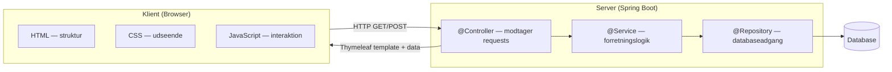
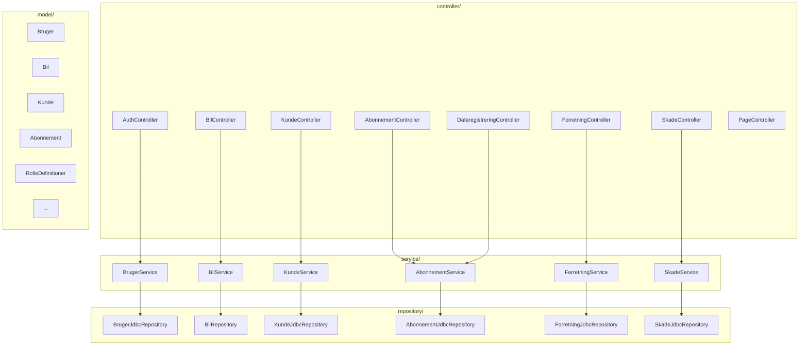
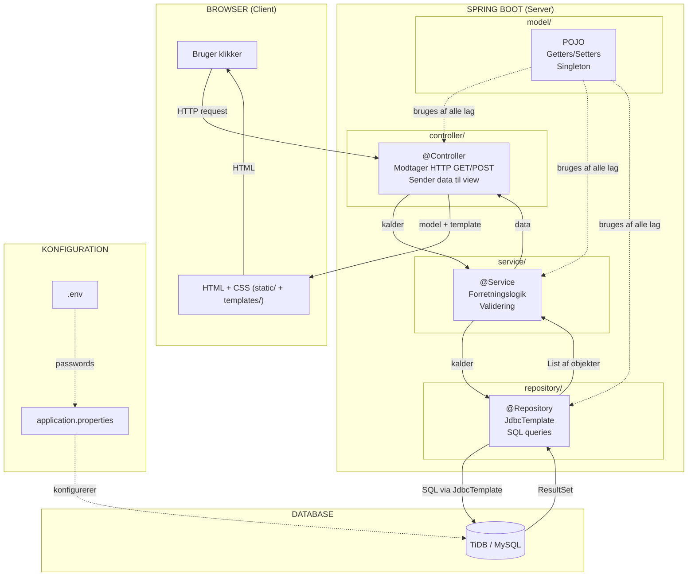

# Koncepter — bilAbonnement

Begreber og principper som projektet er bygget paa, og hvordan de haenger sammen.

---

## GUI via Spring (Client-Server)

GUI via Spring betyder at brugergraensefladen (det brugeren ser) koerer i en **webbrowser**, mens al logik, data og databasekommunikation sker paa **serveren**.



### Hvordan det virker i vores projekt

1. Brugeren aabner `http://localhost:9091` i browseren
2. Browseren sender en HTTP GET-request til serveren
3. Spring Boot modtager requesten i en `@Controller`
4. Controlleren henter data via service og repository
5. Controlleren sender data + Thymeleaf template tilbage
6. Browseren viser den faerdige HTML-side med CSS styling

### Hvorfor bruger vi det?

| Fordel | Forklaring |
|---|---|
| Separat frontend og backend | HTML/CSS i browseren, Java-logik paa serveren |
| Ingen installation | Brugeren aabner bare en URL i browseren |
| Sikkerhed | Databasen er paa serveren, browseren faar aldrig direkte adgang |
| Skalerbarhed | Serveren kan haandtere mange brugere samtidigt |

### Hvad er client vs. server?

```
Client (browser):  Viser GUI'en — HTML, CSS, JavaScript
                   Sender requests til serveren (GET/POST)
                   Modtager svar (HTML-sider med data)

Server (Spring):   Modtager requests fra browseren
                   Haandterer logik, validering, databaseadgang
                   Returnerer HTML-sider via Thymeleaf
```

---

## Packages i Spring

Packages er en maade at organisere koden i projektet paa.
Hver package har et klart ansvarsomraade — det goer projektet overskueligt og modulaert.

### Vores package-struktur

```
src/main/java/com/springmad/bilabonnement/
├── controller/     <- @Controller: haandterer HTTP-requests
├── service/        <- @Service: forretningslogik
├── repository/     <- @Repository: databaseadgang
└── model/          <- Model-klasser (POJO'er): data
```



### Hvad goer hver package?

| Package | Annotation | Ansvar | Maa tale med |
|---|---|---|---|
| `controller/` | `@Controller` | Modtager HTTP-requests, sender data til view | Kun services |
| `service/` | `@Service` | Forretningslogik, validering, regler | Kun repositories |
| `repository/` | `@Repository` | Henter og gemmer data i databasen | Kun databasen |
| `model/` | Ingen (POJO) | Repraesenterer data (felter + getters/setters) | Bruges af alle lag |

### Reglen

```
Controller  →  Service  →  Repository  →  Database
     ↑                                        
  ALDRIG direkte ──────────────────────────────┘
```

En controller maa **aldrig** importere et repository direkte.
Det sikrer separation of concerns — hvert lag har eet ansvar.

---

## Static mappen og Template mappen

Spring Boot har to specielle mapper under `src/main/resources/`:

### `static/` — Statisk indhold

```
src/main/resources/static/
└── css/
    └── style.css
```

- Indeholder alt **statisk** indhold: CSS stylesheets, billeder, JavaScript-filer
- Serveres direkte til browseren uden at Spring bearbejder dem
- Bruges til ressourcer som **ikke aendres** af serveren
- Browseren henter dem direkte via URL (fx `/css/style.css`)

### `templates/` — Dynamiske HTML-sider

```
src/main/resources/templates/
├── fragments/
│   └── navbar.html        <- Genbrugelig navbar (th:fragment)
├── index.html             <- Forside
├── login.html             <- Login-formular
├── signup.html            <- Signup-formular
├── biler.html             <- Bil-oversigt + opret
├── kunder.html            <- Kunde-oversigt + opret
├── abonnementer.html      <- Abonnement-oversigt
├── abonnement-opret.html  <- Opret abonnement
├── data-lejeaftale-opret.html <- Opret lejeaftale
├── dashboard.html         <- KPI-dashboard
├── skader-opret.html      <- Registrer skader
├── about.html             <- Om-siden
└── error.html             <- Fejlside
```

- Indeholder **dynamiske** HTML-sider (Thymeleaf skabeloner)
- Serveres til browseren via en Spring `@Controller` med data indlejret
- Controlleren sender data via `model.addAttribute()`, og Thymeleaf indsaetter det i HTML'en
- Bruges til sider der viser data fra databasen

### Forskellen

```mermaid
graph LR
    BROWSER[Browser]
    
    subgraph "static/"
        CSS[style.css]
    end
    
    subgraph "templates/"
        HTML[biler.html]
    end
    
    CTRL[@Controller]
    
    BROWSER -->|"henter direkte"| CSS
    BROWSER -->|"HTTP GET /biler"| CTRL
    CTRL -->|"model + template"| HTML
    HTML -->|"faerdig HTML"| BROWSER
```

| | `static/` | `templates/` |
|---|---|---|
| **Indhold** | CSS, billeder, JavaScript | HTML-sider (Thymeleaf) |
| **Hvem serverer?** | Browseren henter direkte | Controlleren sender via Thymeleaf |
| **Data fra server?** | Nej — uaendret | Ja — data indlejret med `th:text`, `th:each` osv. |
| **Eksempel** | `style.css` | `biler.html` med alle biler fra databasen |

---

## Application Properties og Environment Variables

### application.properties

Konfigurationsfil for Spring Boot applikationen.
Ligger i `src/main/resources/application.properties`.

```properties
spring.application.name=bilAbonnement
server.port=${PORT:9091}
spring.datasource.url=${SPRING_DATASOURCE_URL:...}
spring.datasource.username=${SPRING_DATASOURCE_USERNAME:...}
spring.datasource.password=${SPRING_DATASOURCE_PASSWORD:...}
spring.datasource.driver-class-name=com.mysql.cj.jdbc.Driver
```

| Indstilling | Hvad den goer |
|---|---|
| `server.port` | Hvilken port serveren lytter paa (default 9091) |
| `spring.datasource.url` | URL til databasen (TiDB/MySQL) |
| `spring.datasource.username` | Brugernavn til databasen |
| `spring.datasource.password` | Password til databasen |
| `spring.datasource.driver-class-name` | Hvilken database-driver der bruges |

### Environment Variables (Miljovariabler)

System-variabler der laeses af applikationen under koersel.
Ligger i `.env` filen og holdes **udenfor koden**.

```
SPRING_DATASOURCE_URL=jdbc:mysql://...
SPRING_DATASOURCE_USERNAME=...
SPRING_DATASOURCE_PASSWORD=...
```

### Hvorfor bruger vi begge?

| Formaal | Forklaring |
|---|---|
| Adskille kode og konfiguration | Passwords staar ikke i Java-koden |
| Fleksibilitet paa forskellige miljoer | Lokal udvikling bruger port 9091, produktion bruger en anden |
| Beskytte foelsomme data | Passwords og noegler skal aldrig hardcodes |

`${PORT:9091}` betyder: brug miljovariablen PORT hvis den er sat, ellers brug 9091.

---

## Hvordan det hele haenger sammen



---

## Spring Annotations

Annotations er smaa maerker (@) i koden som fortaeller Spring hvordan en klasse eller metode skal bruges.
De erstatter XML-konfiguration og goer koden enklere.

### Alle annotations vi bruger i projektet

| Annotation | Hvad den goer | Hvor vi bruger den |
|---|---|---|
| `@Controller` | Markerer en klasse der haandterer HTTP-requests og returnerer **HTML views** | Alle controllers (BilController, AuthController osv.) |
| `@RestController` | Markerer en klasse der returnerer **data (JSON)** i stedet for HTML | ApiController (`/api/biler`, `/api/kunder`, `/api/dashboard`) |
| `@Service` | Markerer en klasse som forretningslogik-lag | Alle services (BilService, KundeService osv.) |
| `@Repository` | Markerer en klasse som databaseadgangs-lag | Alle repositories (BilRepository, KundeJdbcRepository osv.) |
| `@Autowired` | Spring indsaetter en dependency automatisk (dependency injection) | Alle felter i controllers, services og repositories |
| `@GetMapping` | Haandterer HTTP GET-requests (hente data, vise sider) | Alle GET-endpoints |
| `@PostMapping` | Haandterer HTTP POST-requests (sende/oprette data) | Alle POST-endpoints |
| `@RequestMapping` | Saetter en basis-URL for alle endpoints i en controller | `@RequestMapping("/biler")`, `@RequestMapping("/api")` osv. |
| `@RequestParam` | Henter vaerdier fra query-parametre i URL'en (fx `?status=active`) | Login-formular, skade-filtrering osv. |
| `@PathVariable` | Henter vaerdier direkte fra URL-stien (fx `/kunder/slet/5` -> id=5) | Slet-endpoint i KundeController |
| `@ModelAttribute` | Binder formdata fra HTML til et Java-objekt automatisk | Opret bil, opret kunde, signup osv. |

### @Controller vs @RestController

```
@Controller     -> returnerer et VIEW (HTML-side via Thymeleaf)
@RestController -> returnerer DATA (JSON) direkte til browseren

Huskeregl: "Controller viser sider, RestController giver data."
```

**@Controller eksempel** (returnerer HTML):
```java
@Controller
public class BilController {
    @GetMapping("/biler")
    public String bilerPage(Model model) {
        model.addAttribute("biler", bilService.findAll());
        return "biler";  // -> templates/biler.html
    }
}
```

**@RestController eksempel** (returnerer JSON):
```java
@RestController
@RequestMapping("/api")
public class ApiController {
    @GetMapping("/biler")
    public List<Bil> alleBiler() {
        return bilService.findAll();  // -> JSON: [{"id":1,"navn":"Toyota",...}]
    }
}
```

### @RequestParam vs @PathVariable

Begge henter vaerdier fra URL'en, men paa forskellige maader:

```
@RequestParam:  /kunder?id=5        -> henter fra query-parametre
@PathVariable:  /kunder/slet/5      -> henter fra URL-stien

@RequestParam bruges til: filtrering, soegning, formulardata
@PathVariable bruges til: slet, vis detaljer, opdater (med id i URL'en)
```

**@RequestParam eksempel:**
```java
@GetMapping("/opret")
public String visSide(@RequestParam(required = false) Integer kundeId) {
    // URL: /skader/opret?kundeId=3  ->  kundeId = 3
}
```

**@PathVariable eksempel:**
```java
@GetMapping("/slet/{id}")
public String sletKunde(@PathVariable int id) {
    // URL: /kunder/slet/5  ->  id = 5
    kundeService.sletKunde(id);
    return "redirect:/kunder";
}
```

### @GetMapping vs @PostMapping

```
@GetMapping:  HTTP GET  -> hente data, vise sider (ingen sideeffekter)
@PostMapping: HTTP POST -> oprette, aendre, slette data (har sideeffekter)
```

| Handling | HTTP-metode | Annotation | Eksempel |
|---|---|---|---|
| Vis alle biler | GET | `@GetMapping` | `GET /biler` |
| Opret ny bil | POST | `@PostMapping` | `POST /biler` |
| Vis opret-formular | GET | `@GetMapping` | `GET /abonnementer/opret` |
| Gem abonnement | POST | `@PostMapping` | `POST /abonnementer/opret` |
| Slet kunde | GET | `@GetMapping` | `GET /kunder/slet/{id}` |

---

## Tjekliste: Foelger vi reglerne?

| Regel | Status |
|---|---|
| Controller taler kun med Service | Ja — ingen repository-imports i controllers |
| Service taler kun med Repository | Ja — services importerer kun repositories |
| Repository taler kun med Database | Ja — via JdbcTemplate og SQL |
| Model bruges af alle lag | Ja — POJO'er deles paa tvaers |
| Packages er organiseret (controller, service, repository, model) | Ja |
| Static mappen indeholder CSS | Ja — `static/css/style.css` (1 ekstern fil) |
| Template mappen indeholder Thymeleaf HTML | Ja — 13 templates + fragments |
| CSS er external (ikke inline) | Ja — alle templates linker til `style.css`, nul `<style>` blokke |
| @Controller bruges til HTML views | Ja — 7 controllers returnerer Thymeleaf templates |
| @RestController bruges til JSON data | Ja — ApiController returnerer JSON paa `/api/*` |
| @PathVariable bruges til URL-sti vaerdier | Ja — `KundeController: /kunder/slet/{id}` |
| @RequestParam bruges til query-parametre | Ja — login, skade-filtrering, abonnement-opret |
| @ModelAttribute bruges til formular-binding | Ja — opret bil, opret kunde, signup |
| @GetMapping og @PostMapping bruges korrekt | Ja — GET henter data, POST opretter data |
| Passwords er i .env (ikke i koden) | Ja — `application.properties` laeser fra miljoevariabler |
| @Autowired bruges til dependency injection | Ja — paa alle felter i controllers, services og repositories |
| Singleton bruges til delte definitioner | Ja — `RolleDefinitioner.getInstance()` |
