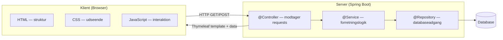
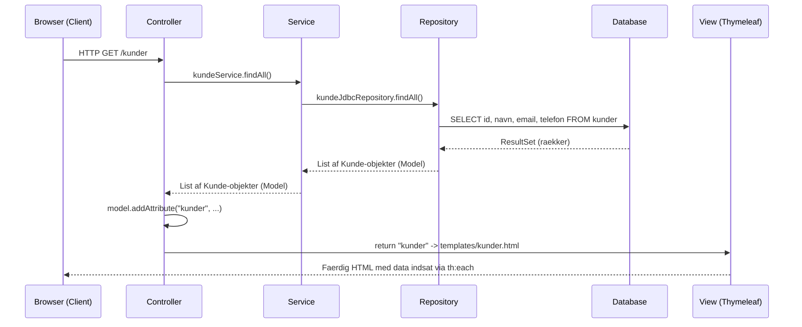
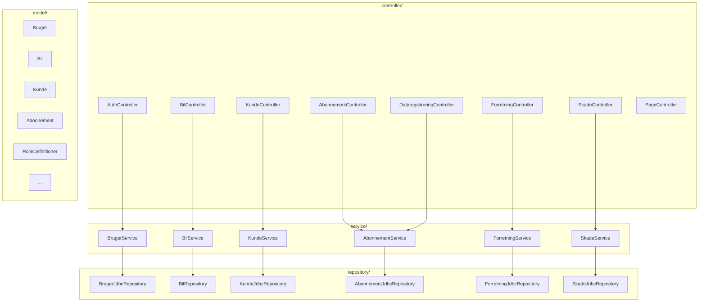
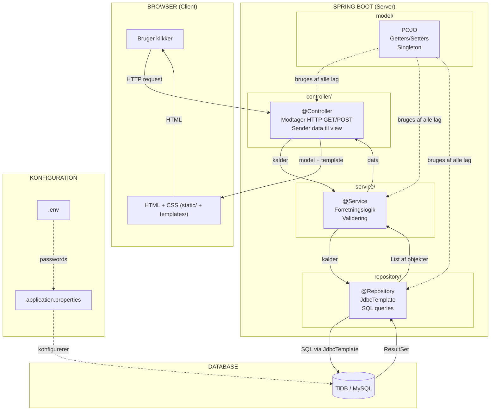

# Koncepter — bilAbonnement

Begreber og principper som projektet er bygget paa, og hvordan de haenger sammen.

---

## GUI via Spring (Client-Server)

GUI via Spring betyder at brugergraensefladen (det brugeren ser) koerer i en **webbrowser**, mens al logik, data og databasekommunikation sker paa **serveren**.



### Hvordan det virker i vores projekt

1. Brugeren aabner `http://localhost:9091` i browseren
2. Browseren sender en HTTP GET-request til serveren
3. Spring Boot modtager requesten i en `@Controller`
4. Controlleren henter data via service og repository
5. Controlleren sender data + Thymeleaf template tilbage
6. Browseren viser den faerdige HTML-side med CSS styling

### Hvorfor bruger vi det?

| Fordel | Forklaring |
|---|---|
| Separat frontend og backend | HTML/CSS i browseren, Java-logik paa serveren |
| Ingen installation | Brugeren aabner bare en URL i browseren |
| Sikkerhed | Databasen er paa serveren, browseren faar aldrig direkte adgang |
| Skalerbarhed | Serveren kan haandtere mange brugere samtidigt |

### Hvad er client vs. server?

```
Client (browser):  Viser GUI'en — HTML, CSS, JavaScript
                   Sender requests til serveren (GET/POST)
                   Modtager svar (HTML-sider med data)

Server (Spring):   Modtager requests fra browseren
                   Haandterer logik, validering, databaseadgang
                   Returnerer HTML-sider via Thymeleaf
```

---

## MVC — Model-View-Controller

MVC er et designmoenstre der adskiller en applikation i tre dele:

| Del | Ansvar | I vores projekt |
|---|---|---|
| **Model** | Data (Java-klasser med felter og getters/setters) | [`Bil`](src/main/java/com/springmad/bilabonnement/model/Bil.java), [`Kunde`](src/main/java/com/springmad/bilabonnement/model/Kunde.java), [`Bruger`](src/main/java/com/springmad/bilabonnement/model/Bruger.java) |
| **View** | Visning (HTML der vises i browseren) | Thymeleaf templates i `templates/` |
| **Controller** | Styring (modtager request, henter data, sender til view) | [`BilController`](src/main/java/com/springmad/bilabonnement/controller/BilController.java), [`KundeController`](src/main/java/com/springmad/bilabonnement/controller/KundeController.java) osv. |

### Fordele ved MVC

- **Decoupling** — views og models er adskilte (man kan aendre HTML uden at aendre Java)
- **Reducerer kompleksitet** — hvert lag har eet ansvar
- **Fleksibelt** — man kan skifte view-teknologi uden at aendre controller/model
- **Testbart** — man kan teste forretningslogik uden HTML

### Saadan virker et request i vores projekt (MVC flow)



### Faktisk kode der viser MVC i aktion

**1. Controller modtager request og henter Model via Service:**

**Faktisk kode fra [`KundeController.java`](src/main/java/com/springmad/bilabonnement/controller/KundeController.java):**
```java
// Fra KundeController.kunderSide():
@GetMapping
public String kunderSide(Model model) {
    model.addAttribute("kunde", new Kunde());           // tom Model til formularen
    model.addAttribute("kunder", kundeService.findAll()); // Model: liste af Kunde-objekter
    return "kunder";                                      // View: templates/kunder.html
}
```

**2. Model er en Java-klasse med data:**

**Faktisk kode fra [`Kunde.java`](src/main/java/com/springmad/bilabonnement/model/Kunde.java):**
```java
// Fra Kunde.java:
public class Kunde {
    private Integer id;
    private String navn;
    private String email;
    private String telefon;
    // + tom konstruktoer, getters og setters
}
```

**3. View viser Model-data via Thymeleaf:**

**Faktisk kode fra [`kunder.html`](src/main/resources/templates/kunder.html):**
```html
<!-- Fra kunder.html: -->
<tr th:each="k : ${kunder}">           <!-- looper gennem List<Kunde> fra controller -->
    <td th:text="${k.id}"></td>          <!-- viser Kunde.getId() -->
    <td th:text="${k.navn}"></td>        <!-- viser Kunde.getNavn() -->
    <td th:text="${k.email}"></td>       <!-- viser Kunde.getEmail() -->
    <td th:text="${k.telefon}"></td>     <!-- viser Kunde.getTelefon() -->
</tr>
```

### UDEN MVC (problemet)

```java
// FOER — alt blandet sammen i een klasse:
// SQL, HTML-generering og request-haandtering i samme metode.
// Problem: uoverskueligt, kan ikke testes, kan ikke genbruges.
```

### MED MVC (loesningen)

```
Controller (KundeController.java)  ->  modtager GET /kunder
  |
  v
Service (KundeService.java)        ->  kalder repository
  |
  v
Repository (KundeJdbcRepository)   ->  koerer SQL, returnerer List<Kunde> (Model)
  |
  v
Controller                         ->  model.addAttribute("kunder", liste)
  |
  v
View (kunder.html)                 ->  th:each="k : ${kunder}" viser data i HTML

Loesning: hvert lag har eet ansvar. Aendringer i HTML paaviker ikke Java.
           Aendringer i SQL paaviker ikke controlleren.
```

### `model.addAttribute()` — bindeledet mellem Controller og View

Controlleren bruger `model.addAttribute(navn, data)` til at sende data til viewet.
Viewet bruger `${navn}` til at hente data fra modellen.

**Faktisk kode fra [`BilController.java`](src/main/java/com/springmad/bilabonnement/controller/BilController.java):**
```java
// Fra BilController.bilerPage():
model.addAttribute("bil", new Bil());             // viewet bruger ${bil} i th:object
model.addAttribute("biler", bilService.findAll()); // viewet bruger ${biler} i th:each
model.addAttribute("unikkeAar", unikkeAar);        // viewet bruger ${unikkeAar}
return "biler";                                     // -> templates/biler.html
```

---

## Packages i Spring

Packages er en maade at organisere koden i projektet paa.
Hver package har et klart ansvarsomraade — det goer projektet overskueligt og modulaert.

### Vores package-struktur

```
src/main/java/com/springmad/bilabonnement/
├── controller/     <- @Controller: haandterer HTTP-requests
├── service/        <- @Service: forretningslogik
├── repository/     <- @Repository: databaseadgang
└── model/          <- Model-klasser (POJO'er): data
```



### Hvad goer hver package?

| Package | Annotation | Ansvar | Maa tale med |
|---|---|---|---|
| `controller/` | `@Controller` | Modtager HTTP-requests, sender data til view | Kun services |
| `service/` | `@Service` | Forretningslogik, validering, regler | Kun repositories |
| `repository/` | `@Repository` | Henter og gemmer data i databasen | Kun databasen |
| `model/` | Ingen (POJO) | Repraesenterer data (felter + getters/setters) | Bruges af alle lag |

### Reglen

```
Controller  →  Service  →  Repository  →  Database
     ↑                                        
  ALDRIG direkte ──────────────────────────────┘
```

En controller maa **aldrig** importere et repository direkte.
Det sikrer separation of concerns — hvert lag har eet ansvar.

---

## Static mappen og Template mappen

Spring Boot har to specielle mapper under `src/main/resources/`:

### `static/` — Statisk indhold

```
src/main/resources/static/
└── css/
    └── style.css
```

- Indeholder alt **statisk** indhold: CSS stylesheets, billeder, JavaScript-filer
- Serveres direkte til browseren uden at Spring bearbejder dem
- Bruges til ressourcer som **ikke aendres** af serveren
- Browseren henter dem direkte via URL (fx `/css/style.css`)

### `templates/` — Dynamiske HTML-sider

```
src/main/resources/templates/
├── fragments/
│   └── navbar.html        <- Genbrugelig navbar (th:fragment)
├── index.html             <- Forside
├── login.html             <- Login-formular
├── signup.html            <- Signup-formular
├── biler.html             <- Bil-oversigt + opret
├── kunder.html            <- Kunde-oversigt + opret
├── abonnementer.html      <- Abonnement-oversigt
├── abonnement-opret.html  <- Opret abonnement
├── data-lejeaftale-opret.html <- Opret lejeaftale
├── dashboard.html         <- KPI-dashboard
├── skader-opret.html      <- Registrer skader
├── about.html             <- Om-siden
└── error.html             <- Fejlside
```

- Indeholder **dynamiske** HTML-sider (Thymeleaf skabeloner)
- Serveres til browseren via en Spring `@Controller` med data indlejret
- Controlleren sender data via `model.addAttribute()`, og Thymeleaf indsaetter det i HTML'en
- Bruges til sider der viser data fra databasen

### Forskellen

```mermaid
graph LR
    BROWSER[Browser]
    
    subgraph "static/"
        CSS[style.css]
    end
    
    subgraph "templates/"
        HTML[biler.html]
    end
    
    CTRL[@Controller]
    
    BROWSER -->|"henter direkte"| CSS
    BROWSER -->|"HTTP GET /biler"| CTRL
    CTRL -->|"model + template"| HTML
    HTML -->|"faerdig HTML"| BROWSER
```

| | `static/` | `templates/` |
|---|---|---|
| **Indhold** | CSS, billeder, JavaScript | HTML-sider (Thymeleaf) |
| **Hvem serverer?** | Browseren henter direkte | Controlleren sender via Thymeleaf |
| **Data fra server?** | Nej — uaendret | Ja — data indlejret med `th:text`, `th:each` osv. |
| **Eksempel** | [`style.css`](src/main/resources/static/css/style.css) | `biler.html` med alle biler fra databasen |

### UDEN external CSS (problemet)

```html
<!-- FOER — inline/internal CSS i HVER template-fil: -->
<head>
    <style>
        body { font-family: Arial; margin: 30px; }
        .fejl { color: red; }
        table { border-collapse: collapse; width: 100%; }
        /* ... 50-180 linjer CSS gentaget i HVER fil ... */
    </style>
</head>
<!-- Problem: 12 filer x ~100 linjer = ~1200 linjer duplikeret CSS.
     Aendring af en farve kraever at man retter i ALLE 12 filer. -->
```

### MED external CSS (loesningen)

**Faktisk kode fra alle templates (fx [`kunder.html`](src/main/resources/templates/kunder.html)):**
```html
<!-- EFTER — 1 linje der linker til den ene CSS-fil: -->
<head>
    <link rel="stylesheet" th:href="@{/css/style.css}">
</head>
<!-- Loesning: al CSS staar i static/css/style.css (1 fil).
     Aendring eet sted paaviker alle 12 sider automatisk. -->
```

---

## Application Properties og Environment Variables

### UDEN environment variables (problemet)

```properties
# FOER — passwords hardcodet direkte i application.properties:
spring.datasource.url=jdbc:mysql://gateway01.eu-central-1.prod.aws.tidbcloud.com:4000/bil_db
spring.datasource.username=479TnvBCBeyNUDJ.root
spring.datasource.password=2Pfphg2mLFGXjD6x
# Problem: application.properties committes til Git.
# Alle der har adgang til Git kan se passwords.
# Passwords er synlige i koden.
```

### MED environment variables (loesningen)

**Faktisk kode fra [`application.properties`](src/main/resources/application.properties):**
```properties
# Fra application.properties:
spring.application.name=bilAbonnement
server.port=${PORT:9091}
spring.datasource.url=${SPRING_DATASOURCE_URL}
spring.datasource.username=${SPRING_DATASOURCE_USERNAME}
spring.datasource.password=${SPRING_DATASOURCE_PASSWORD}
spring.datasource.driver-class-name=com.mysql.cj.jdbc.Driver
# Loesning: passwords staar i .env filen (som er i .gitignore).
# application.properties indeholder kun variabelnavne, ingen vaerdier.
```

| Indstilling | Hvad den goer | Foelsom? |
|---|---|---|
| `server.port` | Hvilken port serveren lytter paa (default 9091) | Nej — har fallback |
| `spring.datasource.url` | URL til databasen (TiDB/MySQL) | Ja — fra .env |
| `spring.datasource.username` | Brugernavn til databasen | Ja — fra .env |
| `spring.datasource.password` | Password til databasen | Ja — fra .env |
| `spring.datasource.driver-class-name` | Hvilken database-driver der bruges | Nej — staar direkte |

### Environment Variables (Miljoevariabler)

System-variabler der laeses af applikationen under koersel.
Ligger i `.env` filen som er i `.gitignore` og **aldrig committes til Git**.

```
# .env filen (holdes lokalt, aldrig i Git)
SPRING_DATASOURCE_URL=jdbc:mysql://gateway01.eu-central-1.prod.aws.tidbcloud.com:4000/bil_db?sslMode=VERIFY_IDENTITY
SPRING_DATASOURCE_USERNAME=dit_brugernavn
SPRING_DATASOURCE_PASSWORD=dit_password
```

### Syntaksen: `${ENV_VAR}` og `${ENV_VAR:fallback}`

```
${PORT:9091}              -> brug PORT hvis sat, ellers 9091 (MED fallback)
${SPRING_DATASOURCE_URL}  -> brug variablen, fejl hvis den ikke er sat (UDEN fallback)
```

**Regel:** Foelsomme data (passwords, brugernavne) skal ALDRIG have en fallback-vaerdi,
fordi fallback-vaerdien staar i `application.properties` som committes til Git.

### Hvorfor bruger vi begge?

| Formaal | Forklaring |
|---|---|
| Adskille kode og konfiguration | Passwords staar i .env, ikke i Java-koden eller application.properties |
| Fleksibilitet paa forskellige miljoer | Lokal udvikling bruger port 9091, produktion bruger en anden |
| Beskytte foelsomme data | .env er i .gitignore — passwords og noegler committes aldrig |

### Hvad goer .gitignore?

`.gitignore` filen fortaeller Git hvilke filer der IKKE skal committes:

```
# Fra vores .gitignore:
.env
.env.*
*.env
```

Det betyder at `.env` aldrig bliver pushet til GitHub, selv hvis den ligger i projektmappen.

---

## Hvordan det hele haenger sammen



---

## Spring Annotations

Annotations er smaa maerker (@) i koden som fortaeller Spring hvordan en klasse eller metode skal bruges.
De erstatter XML-konfiguration og goer koden enklere.

### Alle annotations vi bruger i projektet

| Annotation | Hvad den goer | Hvor vi bruger den |
|---|---|---|
| `@Controller` | Markerer en klasse der haandterer HTTP-requests og returnerer **HTML views** | Alle controllers (BilController, AuthController osv.) |
| `@RestController` | Markerer en klasse der returnerer **data (JSON)** i stedet for HTML | [`ApiController`](src/main/java/com/springmad/bilabonnement/controller/ApiController.java) (`/api/biler`, `/api/kunder`, `/api/dashboard`) |
| `@Service` | Markerer en klasse som forretningslogik-lag | Alle services (BilService, KundeService osv.) |
| `@Repository` | Markerer en klasse som databaseadgangs-lag | Alle repositories (BilRepository, KundeJdbcRepository osv.) |
| `@Autowired` | Spring indsaetter en dependency automatisk (dependency injection) | Alle felter i controllers, services og repositories |
| `@GetMapping` | Haandterer HTTP GET-requests (hente data, vise sider) | Alle GET-endpoints |
| `@PostMapping` | Haandterer HTTP POST-requests (sende/oprette data) | Alle POST-endpoints |
| `@RequestMapping` | Saetter en basis-URL for alle endpoints i en controller | `@RequestMapping("/biler")`, `@RequestMapping("/api")` osv. |
| `@RequestParam` | Henter vaerdier fra query-parametre i URL'en (fx `?status=active`) | Login-formular, skade-filtrering osv. |
| `@PathVariable` | Henter vaerdier direkte fra URL-stien (fx `/kunder/slet/5` -> id=5) | Slet-endpoint i KundeController |
| `@ModelAttribute` | Binder formdata fra HTML til et Java-objekt automatisk | Opret bil, opret kunde, signup osv. |

### @Controller vs @RestController

Huskeregl: **"Controller viser sider, RestController giver data."**

**UDEN @RestController** — @Controller returnerer HTML:

**Faktisk kode fra [`BilController.java`](src/main/java/com/springmad/bilabonnement/controller/BilController.java):**
```java
// Fra BilController.bilerPage():
@GetMapping
public String bilerPage(Model model) {
    model.addAttribute("bil", new Bil());
    List<Bil> biler = bilService.findAll();
    model.addAttribute("biler", biler);
    TreeSet<Integer> unikkeAar = new TreeSet<>();
    for (Bil b : biler) {
        unikkeAar.add(b.getAar());
    }
    model.addAttribute("unikkeAar", unikkeAar);
    return "biler";
}
// Returnerer et VIEW-navn ("biler") -> Spring finder templates/biler.html
// Browseren faar en HTML-side med data indlejret via Thymeleaf.
// Problem: hvis en JavaScript-app eller mobil-app vil have data, faar den HTML i stedet.
```

**MED @RestController** — returnerer JSON direkte:

**Faktisk kode fra [`ApiController.java`](src/main/java/com/springmad/bilabonnement/controller/ApiController.java):**
```java
// Fra ApiController.alleBiler():
@GetMapping("/biler")
public List<Bil> alleBiler() {
    return bilService.findAll();
}
// Returnerer DATA direkte som JSON: [{"id":1,"navn":"Toyota Yaris","aar":2022}, ...]
// Loesning: enhver klient (browser, app, JavaScript) kan bruge dataen.
```

### @RequestParam vs @PathVariable

Begge henter vaerdier fra URL'en, men paa forskellige maader:

```
@RequestParam:  /kunder?id=5        -> henter fra query-parametre
@PathVariable:  /kunder/slet/5      -> henter fra URL-stien

@RequestParam bruges til: filtrering, soegning, formulardata
@PathVariable bruges til: slet, vis detaljer, opdater (med id i URL'en)
```

**Faktisk kode fra [`SkadeController.java`](src/main/java/com/springmad/bilabonnement/controller/SkadeController.java)** — @RequestParam:
```java
// Fra SkadeController.visSide():
@GetMapping("/opret")
public String visSide(@RequestParam(required = false) Integer kundeId,
                      @RequestParam(required = false) Integer abonnementId,
                      Model model,
                      HttpSession session) {
```

**Faktisk kode fra [`KundeController.java`](src/main/java/com/springmad/bilabonnement/controller/KundeController.java)** — @PathVariable:
```java
// Fra KundeController.sletKunde():
@GetMapping("/slet/{id}")
public String sletKunde(@PathVariable int id) {
    kundeService.sletKunde(id);
    return "redirect:/kunder";
}
```

### @GetMapping vs @PostMapping

```
@GetMapping:  HTTP GET  -> hente data, vise sider (ingen sideeffekter)
@PostMapping: HTTP POST -> oprette, aendre, slette data (har sideeffekter)
```

| Handling | HTTP-metode | Annotation | Eksempel |
|---|---|---|---|
| Vis alle biler | GET | `@GetMapping` | `GET /biler` |
| Opret ny bil | POST | `@PostMapping` | `POST /biler` |
| Vis opret-formular | GET | `@GetMapping` | `GET /abonnementer/opret` |
| Gem abonnement | POST | `@PostMapping` | `POST /abonnementer/opret` |
| Slet kunde | GET | `@GetMapping` | `GET /kunder/slet/{id}` |

---

## Java og MySQL (JDBC)

Java kommunikerer med MySQL-databasen via JDBC (Java Database Connectivity).
Strukturen er altid den samme: forbind -> kør SQL -> hent resultater -> vis data.

### UDEN JdbcTemplate — raa JDBC (fra pensum)

Pensum viser den manuelle maade med `DriverManager`, `Connection`, `Statement` og `ResultSet`:

```java
// FOER — raa JDBC (manuelt, mange linjer):
import java.sql.*;

// 1. Forbindelse til databasen
Connection con = DriverManager.getConnection(
    "jdbc:mysql://localhost:3306/bil_db", "root", "password");

// 2. Opret et Statement-objekt
Statement s = con.createStatement();

// 3. Kør SQL og faa et ResultSet tilbage
ResultSet rs = s.executeQuery("SELECT id, navn, email FROM kunder");

// 4. Gennemløb ResultSet raekke for raekke
while (rs.next()) {
    int id = rs.getInt("id");           // kolonne 1
    String navn = rs.getString("navn"); // kolonne 2
    String email = rs.getString("email"); // kolonne 3
}

// 5. Luk forbindelsen (VIGTIGT — ellers laekkker vi forbindelser)
rs.close();
s.close();
con.close();

// Problemer:
//   - Mange linjer boilerplate-kode
//   - Man skal selv lukke Connection, Statement, ResultSet
//   - Ingen beskyttelse mod SQL-injection (med Statement)
//   - Man skal selv haandtere exceptions med try/catch
```

### MED JdbcTemplate — Spring's loesning (det vi bruger)

Spring's JdbcTemplate goer det samme som raa JDBC, men fjerner al boilerplate.
Spring haandterer Connection, Statement, close() og exceptions automatisk.

**Faktisk kode fra [`KundeJdbcRepository.java`](src/main/java/com/springmad/bilabonnement/repository/KundeJdbcRepository.java):**
```java
// Fra KundeJdbcRepository.findAll():
public List<Kunde> findAll() {
    String sql = "SELECT id, navn, email, telefon FROM kunder";
    return jdbcTemplate.query(sql, new BeanPropertyRowMapper<>(Kunde.class));
}
// Spring haandterer Connection, Statement, ResultSet og close() automatisk.
// BeanPropertyRowMapper mapper ResultSet til Kunde-objekter automatisk.
// Parameteriseret query (?) beskytter mod SQL-injection.
```

**Faktisk kode fra [`KundeJdbcRepository.java`](src/main/java/com/springmad/bilabonnement/repository/KundeJdbcRepository.java) — INSERT:**
```java
// Fra KundeJdbcRepository.opretKunde():
public void opretKunde(Kunde kunde) {
    String sql = "INSERT INTO kunder (navn, email, telefon) VALUES (?, ?, ?)";
    jdbcTemplate.update(sql, kunde.getNavn(), kunde.getEmail(), kunde.getTelefon());
}
// jdbc.update() bruges til INSERT, UPDATE og DELETE (ligesom executeUpdate i raa JDBC).
// ? parametre beskytter mod SQL-injection (prepared statement).
```

**Faktisk kode fra [`KundeJdbcRepository.java`](src/main/java/com/springmad/bilabonnement/repository/KundeJdbcRepository.java) — DELETE:**
```java
// Fra KundeJdbcRepository.sletKunde():
public void sletKunde(int id) {
    String sql = "DELETE FROM kunder WHERE id = ?";
    jdbcTemplate.update(sql, id);
}
```

### Sammenligning: raa JDBC vs JdbcTemplate

| | Raa JDBC (fra pensum) | JdbcTemplate (det vi bruger) |
|---|---|---|
| **Forbindelse** | `DriverManager.getConnection(url, user, pass)` | Spring goer det automatisk via `application.properties` |
| **SELECT** | `s.executeQuery(sql)` returnerer `ResultSet` | `jdbc.query(sql, rowMapper)` returnerer `List<Objekt>` |
| **INSERT/UPDATE/DELETE** | `s.executeUpdate(sql)` | `jdbc.update(sql, params)` |
| **ResultSet** | Manuelt: `rs.getInt()`, `rs.getString()` | Automatisk via RowMapper eller BeanPropertyRowMapper |
| **Lukke forbindelse** | Manuelt: `con.close()`, `rs.close()`, `s.close()` | Automatisk — Spring goer det |
| **SQL-injection** | Saarbar med `Statement` | Beskyttet med `?` parametre |
| **Exceptions** | Manuelt: `try/catch SQLException` | Spring wrapper dem automatisk |

### URL'en forklaret

Vores database-URL fra [`.env`](.env):
```
jdbc:mysql://gateway01.eu-central-1.prod.aws.tidbcloud.com:4000/bil_db?sslMode=VERIFY_IDENTITY
│     │      │                                                   │    │
│     │      │                                                   │    └── databasenavn
│     │      │                                                   └── port
│     │      └── netvaerksadresse (host)
│     └── type af database (MySQL)
└── JDBC protokol
```

### Hvor i projektet bruger vi JDBC?

| Repository | SELECT (query) | INSERT/UPDATE/DELETE (update) |
|---|---|---|
| [`KundeJdbcRepository`](src/main/java/com/springmad/bilabonnement/repository/KundeJdbcRepository.java) | `jdbc.query()` med BeanPropertyRowMapper | `jdbc.update()` med INSERT og DELETE |
| [`BrugerJdbcRepository`](src/main/java/com/springmad/bilabonnement/repository/BrugerJdbcRepository.java) | `jdbc.query()` med BeanPropertyRowMapper | `jdbc.update()` med INSERT |
| [`BilRepository`](src/main/java/com/springmad/bilabonnement/repository/BilRepository.java) | `jdbc.query()` med manuel RowMapper | `jdbc.update()` med INSERT |
| [`AbonnementJdbcRepository`](src/main/java/com/springmad/bilabonnement/repository/AbonnementJdbcRepository.java) | `jdbc.query()` med manuel RowMapper, `jdbc.queryForObject()` | `jdbc.update()` med INSERT |
| [`ForretningJdbcRepository`](src/main/java/com/springmad/bilabonnement/repository/ForretningJdbcRepository.java) | `jdbc.queryForObject()` med COUNT/SUM, `jdbc.queryForList()` | Ingen |
| [`SkadeJdbcRepository`](src/main/java/com/springmad/bilabonnement/repository/SkadeJdbcRepository.java) | `jdbc.queryForList()` | `jdbc.update()` med INSERT |

---

## Exception Handling (try, catch, throw, throws, finally)

Naar et program stoeder paa en fejl under koersel, terminerer det normalt.
Exception handling goer at vi kan **fange fejlen** og haandtere den, saa programmet kan fortsaette eller stoppe kontrolleret.

### De fem noegleord

| Noegleord | Hvad det goer | Hvor vi bruger det |
|---|---|---|
| `try` | Indeholder kode der KAN fejle | [`AbonnementController`](src/main/java/com/springmad/bilabonnement/controller/AbonnementController.java) |
| `catch` | Fanger en specifik exception og haandterer den | [`AbonnementController`](src/main/java/com/springmad/bilabonnement/controller/AbonnementController.java) (3 catch-blokke) |
| `throw` | Kaster en exception manuelt | [`AbonnementService`](src/main/java/com/springmad/bilabonnement/service/AbonnementService.java) |
| `throws` | Erklaerer at en metode KAN kaste en exception | [`AbonnementJdbcRepository`](src/main/java/com/springmad/bilabonnement/repository/AbonnementJdbcRepository.java) (RowMapper: `throws SQLException`) |
| `finally` | Koerer ALTID, uanset om der var en exception eller ej | [`AbonnementController`](src/main/java/com/springmad/bilabonnement/controller/AbonnementController.java) |

### UDEN exception handling (problemet)

```java
// FOER — ingen try/catch:
abonnementService.opretAbonnementHvisMuligt(kundeNavn, bilId, startdato, slutdato, pris);
// Hvis kunden ikke findes i databasen, crasher hele applikationen.
// Brugeren ser en grim fejlside i stedet for en hjaelpsom besked.
// Programmet stopper — alle andre brugere paavirkes.
```

### MED exception handling (loesningen)

**Faktisk kode fra [`AbonnementController.java`](src/main/java/com/springmad/bilabonnement/controller/AbonnementController.java) — try, catch (3 blokke), finally:**
```java
// Fra AbonnementController.opretAbonnement():
try {
    abonnementService.opretAbonnementHvisMuligt(
            kundeNavn, bilId.intValue(), startdato, slutdato, maanedligPris
    );

} catch (EmptyResultDataAccessException e) {
    // Catch 1: kunden findes ikke i databasen
    model.addAttribute("fejl", "Kunden findes ikke. Opret kunden foerst under /kunder.");
    model.addAttribute("biler", bilService.findAll());
    return "abonnement-opret";

} catch (IllegalArgumentException e) {
    // Catch 2: ugyldigt input (tomt kundenavn, negativ pris)
    model.addAttribute("fejl", e.getMessage());
    model.addAttribute("biler", bilService.findAll());
    return "abonnement-opret";

} catch (IllegalStateException e) {
    // Catch 3: kunden har allerede et aktivt abonnement
    model.addAttribute("fejl", e.getMessage());
    model.addAttribute("biler", bilService.findAll());
    return "abonnement-opret";

} finally {
    // Koerer ALTID — bruges til oprydning/logning
    System.out.println("Abonnement-oprettelse forsoegte for kunde: " + kundeNavn);
}
```

**Faktisk kode fra [`AbonnementService.java`](src/main/java/com/springmad/bilabonnement/service/AbonnementService.java) — throw:**
```java
// Fra AbonnementService.opretAbonnementHvisMuligt():
if (kundeNavn == null || kundeNavn.isBlank()) {
    throw new IllegalArgumentException("Kundenavn maa ikke vaere tomt.");
}

if (maanedligPris == null || maanedligPris.compareTo(BigDecimal.ZERO) <= 0) {
    throw new IllegalArgumentException("Maanedlig pris skal vaere positiv.");
}

if (abonnementJdbcRepository.harAktivtAbonnementForKundeNavn(kundeNavn)) {
    throw new IllegalStateException("Kunden har allerede et aktivt abonnement.");
}
```

**Faktisk kode fra [`AbonnementJdbcRepository.java`](src/main/java/com/springmad/bilabonnement/repository/AbonnementJdbcRepository.java) — throws:**
```java
// Fra AbonnementJdbcRepository — throws erklaerer at metoden KAN kaste SQLException:
private AbonnementOversigt mapRowTilAbonnementOversigt(ResultSet rs) throws SQLException {
    AbonnementOversigt dto = new AbonnementOversigt();
    dto.setAbonnementId(rs.getInt("abonnement_id"));
    // ... throws betyder: "denne metode kan fejle med SQLException,
    //     og den der kalder den skal haandtere det."
}
```

### Forskellen paa `throw` og `throws`

```
throw  = KASTER en exception (sker i koden, fx i AbonnementService)
throws = ERKLAERER at en metode KAN kaste en exception (staar i metode-signaturen)
```

### Exception-typer vi bruger

| Exception | Type | Hvad den betyder | Hvor vi kaster den |
|---|---|---|---|
| `IllegalArgumentException` | RuntimeException (unchecked) | Ugyldigt input fra brugeren | [`AbonnementService`](src/main/java/com/springmad/bilabonnement/service/AbonnementService.java) |
| `IllegalStateException` | RuntimeException (unchecked) | Ugyldig tilstand (fx dublet-abonnement) | [`AbonnementService`](src/main/java/com/springmad/bilabonnement/service/AbonnementService.java) |
| `EmptyResultDataAccessException` | RuntimeException (unchecked) | Ingen data fundet i databasen | [`AbonnementJdbcRepository`](src/main/java/com/springmad/bilabonnement/repository/AbonnementJdbcRepository.java) |
| `SQLException` | Exception (checked) | Database-fejl | RowMapper-metoder (via `throws`) |

### Flowet: throw -> catch

```
1. Bruger udfylder formular og klikker "Gem"
2. AbonnementController kalder AbonnementService
3. AbonnementService tjekker: er kundeNavn tomt?
4. JA -> throw new IllegalArgumentException("Kundenavn maa ikke vaere tomt.")
5. Exception "bobler op" til AbonnementController
6. catch (IllegalArgumentException e) fanger den
7. Controller viser fejlbesked til brugeren: e.getMessage()
8. finally koerer: logger forsoget
9. Programmet crasher IKKE — brugeren ser en hjaelpsom besked
```

---

## Autowiring (Dependency Injection)

Autowiring er Spring's maade at automatisk "indsaette" afhaengigheder i en klasse,
uden at man selv behoever at oprette objekterne med `new`.

### UDEN @Autowired (problemet)

```java
// FOER — manuelt med new:
public class BilController {
    private BilService bilService = new BilService();  // VIRKER IKKE
    // Problem 1: BilService har selv brug for BilRepository — hvem opretter det?
    // Problem 2: BilRepository har brug for JdbcTemplate — hvem opretter det?
    // Problem 3: Vi skal styre ALLE objekters livscyklus selv
}
```

### MED @Autowired (loesningen)

**Faktisk kode fra [`BilController.java`](src/main/java/com/springmad/bilabonnement/controller/BilController.java):**
```java
// Fra BilController.java:
@Autowired
private BilService bilService;
// Spring opretter BilService automatisk og indsaetter den her.
// Vi skriver aldrig "new BilService()".
```

Spring ser `@Autowired` og loser hele kaeden automatisk:
BilController -> BilService -> BilRepository -> JdbcTemplate.

### Hele kaeden med @Autowired

Spring indsaetter afhaengigheder i hele kaeden automatisk:

```
Spring ser at BilController har @Autowired BilService
  -> Spring opretter BilService
  -> Spring ser at BilService har @Autowired BilRepository
     -> Spring opretter BilRepository
     -> Spring ser at BilRepository har @Autowired JdbcTemplate
        -> Spring opretter JdbcTemplate (fra application.properties)
```

Vi skriver aldrig `new` for nogen af disse objekter. Spring goer det hele.

### Hvor bruger vi @Autowired i projektet?

| Lag | Klasse | Hvad der injiceres | Hvorfor |
|---|---|---|---|
| Controller | [`BilController`](src/main/java/com/springmad/bilabonnement/controller/BilController.java) | [`BilService`](src/main/java/com/springmad/bilabonnement/service/BilService.java) | Controller taler med service |
| Controller | [`KundeController`](src/main/java/com/springmad/bilabonnement/controller/KundeController.java) | [`KundeService`](src/main/java/com/springmad/bilabonnement/service/KundeService.java) | Controller taler med service |
| Controller | [`AuthController`](src/main/java/com/springmad/bilabonnement/controller/AuthController.java) | [`BrugerService`](src/main/java/com/springmad/bilabonnement/service/BrugerService.java) | Controller taler med service |
| Controller | [`AbonnementController`](src/main/java/com/springmad/bilabonnement/controller/AbonnementController.java) | [`AbonnementService`](src/main/java/com/springmad/bilabonnement/service/AbonnementService.java), [`BilService`](src/main/java/com/springmad/bilabonnement/service/BilService.java) | Controller taler med services |
| Controller | [`DataregistreringController`](src/main/java/com/springmad/bilabonnement/controller/DataregistreringController.java) | [`AbonnementService`](src/main/java/com/springmad/bilabonnement/service/AbonnementService.java), [`BilService`](src/main/java/com/springmad/bilabonnement/service/BilService.java), [`KundeService`](src/main/java/com/springmad/bilabonnement/service/KundeService.java), [`BrugerService`](src/main/java/com/springmad/bilabonnement/service/BrugerService.java) | Controller taler med services |
| Controller | [`ForretningController`](src/main/java/com/springmad/bilabonnement/controller/ForretningController.java) | [`ForretningService`](src/main/java/com/springmad/bilabonnement/service/ForretningService.java), [`BrugerService`](src/main/java/com/springmad/bilabonnement/service/BrugerService.java) | Controller taler med services |
| Controller | [`SkadeController`](src/main/java/com/springmad/bilabonnement/controller/SkadeController.java) | [`SkadeService`](src/main/java/com/springmad/bilabonnement/service/SkadeService.java), [`KundeService`](src/main/java/com/springmad/bilabonnement/service/KundeService.java), [`BrugerService`](src/main/java/com/springmad/bilabonnement/service/BrugerService.java) | Controller taler med services |
| Controller | [`ApiController`](src/main/java/com/springmad/bilabonnement/controller/ApiController.java) | [`BilService`](src/main/java/com/springmad/bilabonnement/service/BilService.java), [`KundeService`](src/main/java/com/springmad/bilabonnement/service/KundeService.java), [`ForretningService`](src/main/java/com/springmad/bilabonnement/service/ForretningService.java) | RestController taler med services |
| Service | [`BilService`](src/main/java/com/springmad/bilabonnement/service/BilService.java) | [`BilRepository`](src/main/java/com/springmad/bilabonnement/repository/BilRepository.java) | Service taler med repository |
| Service | [`KundeService`](src/main/java/com/springmad/bilabonnement/service/KundeService.java) | [`KundeJdbcRepository`](src/main/java/com/springmad/bilabonnement/repository/KundeJdbcRepository.java) | Service taler med repository |
| Service | [`BrugerService`](src/main/java/com/springmad/bilabonnement/service/BrugerService.java) | [`BrugerJdbcRepository`](src/main/java/com/springmad/bilabonnement/repository/BrugerJdbcRepository.java) | Service taler med repository |
| Service | [`AbonnementService`](src/main/java/com/springmad/bilabonnement/service/AbonnementService.java) | [`AbonnementJdbcRepository`](src/main/java/com/springmad/bilabonnement/repository/AbonnementJdbcRepository.java) | Service taler med repository |
| Service | [`ForretningService`](src/main/java/com/springmad/bilabonnement/service/ForretningService.java) | [`ForretningJdbcRepository`](src/main/java/com/springmad/bilabonnement/repository/ForretningJdbcRepository.java) | Service taler med repository |
| Service | [`SkadeService`](src/main/java/com/springmad/bilabonnement/service/SkadeService.java) | [`SkadeJdbcRepository`](src/main/java/com/springmad/bilabonnement/repository/SkadeJdbcRepository.java), [`AbonnementJdbcRepository`](src/main/java/com/springmad/bilabonnement/repository/AbonnementJdbcRepository.java) | Service taler med repositories |
| Repository | [`BilRepository`](src/main/java/com/springmad/bilabonnement/repository/BilRepository.java) | JdbcTemplate | Repository taler med database |
| Repository | [`KundeJdbcRepository`](src/main/java/com/springmad/bilabonnement/repository/KundeJdbcRepository.java) | JdbcTemplate | Repository taler med database |
| Repository | [`BrugerJdbcRepository`](src/main/java/com/springmad/bilabonnement/repository/BrugerJdbcRepository.java) | JdbcTemplate | Repository taler med database |
| Repository | [`AbonnementJdbcRepository`](src/main/java/com/springmad/bilabonnement/repository/AbonnementJdbcRepository.java) | JdbcTemplate | Repository taler med database |
| Repository | [`ForretningJdbcRepository`](src/main/java/com/springmad/bilabonnement/repository/ForretningJdbcRepository.java) | JdbcTemplate | Repository taler med database |
| Repository | [`SkadeJdbcRepository`](src/main/java/com/springmad/bilabonnement/repository/SkadeJdbcRepository.java) | JdbcTemplate | Repository taler med database |

### Hvor bruger vi IKKE @Autowired?

| Klasse | Hvorfor ingen @Autowired |
|---|---|
| [`PageController`](src/main/java/com/springmad/bilabonnement/controller/PageController.java) | Har ingen afhaengigheder — returnerer kun view-navne ("index", "about") |
| [`Bil`](src/main/java/com/springmad/bilabonnement/model/Bil.java), [`Kunde`](src/main/java/com/springmad/bilabonnement/model/Kunde.java), [`Bruger`](src/main/java/com/springmad/bilabonnement/model/Bruger.java) (models) | Er POJO'er — de er ikke Spring-styrede, de oprettes med `new` i controllers |
| [`RolleDefinitioner`](src/main/java/com/springmad/bilabonnement/model/RolleDefinitioner.java) (Singleton) | Styres af Singleton-patternet (privat konstruktoer + getInstance()), ikke af Spring |

---

## ResultSet, RowMapper og BeanPropertyRowMapper

Naar vi henter data fra databasen med JdbcTemplate, faar vi et **ResultSet** tilbage.
ResultSet er raekker af raa data — vi skal konvertere dem til Java-objekter.
Det goer vi med en **RowMapper**.

### UDEN BeanPropertyRowMapper — manuel RowMapper (problemet)

Man henter HVERT felt manuelt fra ResultSet og saetter det paa objektet.
Mange linjer kode, risiko for stavefejl i kolonnenavne.

**Faktisk kode fra [`BilRepository.java`](src/main/java/com/springmad/bilabonnement/repository/BilRepository.java):**
```java
// Fra BilRepository — vi henter HVERT felt fra ResultSet manuelt:
private final RowMapper<Bil> bilRowMapper = (rs, rowNum) -> {
    Bil bil = new Bil();
    bil.setId(rs.getInt("id"));                    // manuelt
    bil.setNavn(rs.getString("navn"));              // manuelt
    bil.setAar(rs.getInt("aar"));                   // manuelt
    bil.setStartsdato(rs.getDate("startsdato") != null ? rs.getDate("startsdato").toLocalDate() : null);  // manuelt
    bil.setSlutsdato(rs.getDate("slutsdato") != null ? rs.getDate("slutsdato").toLocalDate() : null);     // manuelt
    return bil;
};

public List<Bil> findAll() {
    String sql = "SELECT id, navn, aar, startsdato, slutsdato FROM biler";
    return jdbc.query(sql, bilRowMapper);
}
// Problem: 5 felter = 5 linjer manual mapping.
// Hvis vi skriver rs.getString("navnn") (stavefejl), crasher det ved koersel.
// Vi SKAL bruge manuel RowMapper her fordi rs.getDate().toLocalDate() kraever type-konvertering.
```

### MED BeanPropertyRowMapper (loesningen)

Spring mapper AUTOMATISK kolonner til felter baseret paa navne.
Nul manuel mapping, nul risiko for stavefejl.

**Faktisk kode fra [`KundeJdbcRepository.java`](src/main/java/com/springmad/bilabonnement/repository/KundeJdbcRepository.java):**
```java
// Fra KundeJdbcRepository.findAll():
public List<Kunde> findAll() {
    String sql = "SELECT id, navn, email, telefon FROM kunder";
    return jdbcTemplate.query(sql, new BeanPropertyRowMapper<>(Kunde.class));
}
// Loesning: 1 linje i stedet for 4 linjer manuel mapping.
// Spring matcher automatisk: kolonne "navn" -> setNavn(), "email" -> setEmail() osv.
```

**Faktisk kode fra [`BrugerJdbcRepository.java`](src/main/java/com/springmad/bilabonnement/repository/BrugerJdbcRepository.java):**
```java
// Fra BrugerJdbcRepository.findByNavnOgPassword():
public Bruger findByNavnOgPassword(String navn, String password) {
    String sql = "SELECT id, navn, alder, rolle, password FROM brugere WHERE navn = ? AND password = ? LIMIT 1";
    List<Bruger> resultater = jdbcTemplate.query(sql,
            new BeanPropertyRowMapper<>(Bruger.class),
            navn, password);
    return resultater.stream().findFirst().orElse(null);
}
// Loesning: 5 kolonner mappes automatisk til 5 felter. Ingen rs.getXxx() noedvendig.
```

### Hvornaar bruger man hvilken?

- **Manuel RowMapper** naar man skal konvertere typer (fx `Date` -> `LocalDate`) eller kolonnenavne ikke matcher
- **BeanPropertyRowMapper** naar kolonnenavne matcher feltnavne og man vil spare tid

### Sammenligning

| | Manuel RowMapper | BeanPropertyRowMapper |
|---|---|---|
| **Kode** | Man skriver `rs.getXxx()` for hvert felt | Automatisk — ingen mapping-kode |
| **Fleksibilitet** | Fuld kontrol over konvertering | Kraever matchende navne |
| **Fejlrisiko** | Stavefejl i kolonnenavne mulig | Ingen — Spring matcher automatisk |
| **Bruges naar** | Navne ikke matcher, eller man skal konvertere typer | Navne matcher direkte |

### Hvor i projektet?

| Repository | Mapping-metode | Hvorfor |
|---|---|---|
| [`KundeJdbcRepository`](src/main/java/com/springmad/bilabonnement/repository/KundeJdbcRepository.java) | BeanPropertyRowMapper | Kolonner (`id`, `navn`, `email`, `telefon`) matcher felter direkte |
| [`BrugerJdbcRepository`](src/main/java/com/springmad/bilabonnement/repository/BrugerJdbcRepository.java) | BeanPropertyRowMapper | Kolonner (`id`, `navn`, `alder`, `rolle`, `password`) matcher felter direkte |
| [`BilRepository`](src/main/java/com/springmad/bilabonnement/repository/BilRepository.java) | Manuel RowMapper | `rs.getDate().toLocalDate()` kraever manuel type-konvertering |
| [`AbonnementJdbcRepository`](src/main/java/com/springmad/bilabonnement/repository/AbonnementJdbcRepository.java) | Manuel RowMapper | JOIN-query med aliaser (`kunde_navn`, `bil_navn`) matcher ikke felter |

---

## Tjekliste: Foelger vi reglerne?

| Regel | Status |
|---|---|
| Controller taler kun med Service | Ja — ingen repository-imports i controllers |
| Service taler kun med Repository | Ja — services importerer kun repositories |
| Repository taler kun med Database | Ja — via JdbcTemplate og SQL |
| Model bruges af alle lag | Ja — POJO'er deles paa tvaers |
| Packages er organiseret (controller, service, repository, model) | Ja |
| Static mappen indeholder CSS | Ja — [`style.css`](src/main/resources/static/css/style.css) (1 ekstern fil) |
| Template mappen indeholder Thymeleaf HTML | Ja — 13 templates + fragments |
| CSS er external (ikke inline) | Ja — alle templates linker til [`style.css`](src/main/resources/static/css/style.css), nul `<style>` blokke |
| @Controller bruges til HTML views | Ja — 7 controllers returnerer Thymeleaf templates |
| @RestController bruges til JSON data | Ja — [`ApiController`](src/main/java/com/springmad/bilabonnement/controller/ApiController.java) returnerer JSON paa `/api/*` |
| @PathVariable bruges til URL-sti vaerdier | Ja — [`KundeController`](src/main/java/com/springmad/bilabonnement/controller/KundeController.java): `/kunder/slet/{id}` |
| @RequestParam bruges til query-parametre | Ja — login, skade-filtrering, abonnement-opret |
| @ModelAttribute bruges til formular-binding | Ja — opret bil, opret kunde, signup |
| @GetMapping og @PostMapping bruges korrekt | Ja — GET henter data, POST opretter data |
| ResultSet og RowMapper bruges til database-mapping | Ja — i [`BilRepository`](src/main/java/com/springmad/bilabonnement/repository/BilRepository.java), [`BrugerJdbcRepository`](src/main/java/com/springmad/bilabonnement/repository/BrugerJdbcRepository.java), [`AbonnementJdbcRepository`](src/main/java/com/springmad/bilabonnement/repository/AbonnementJdbcRepository.java) |
| BeanPropertyRowMapper bruges til automatisk mapping | Ja — i [`KundeJdbcRepository`](src/main/java/com/springmad/bilabonnement/repository/KundeJdbcRepository.java) og [`BrugerJdbcRepository`](src/main/java/com/springmad/bilabonnement/repository/BrugerJdbcRepository.java) |
| LinkedList og Iterator bruges til indsaettelse | Ja — i [`SkadeJdbcRepository`](src/main/java/com/springmad/bilabonnement/repository/SkadeJdbcRepository.java) |
| Git bruges til versionskontrol | Ja — projektet er et Git-repository |
| Passwords er i .env (ikke i koden) | Ja — [`application.properties`](src/main/resources/application.properties) laeser fra miljoevariabler |
| @Autowired bruges til dependency injection | Ja — paa alle felter i controllers, services og repositories |
| Singleton bruges til delte definitioner | Ja — [`RolleDefinitioner`](src/main/java/com/springmad/bilabonnement/model/RolleDefinitioner.java)`.getInstance()` |
