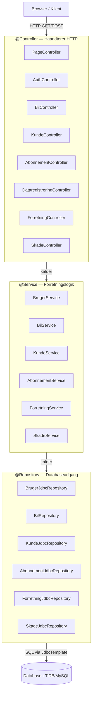
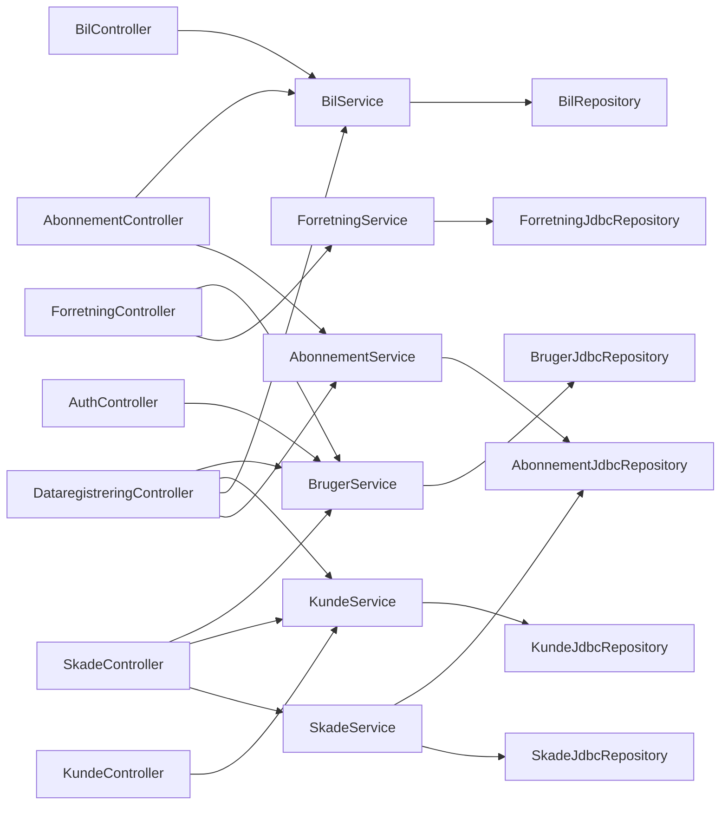
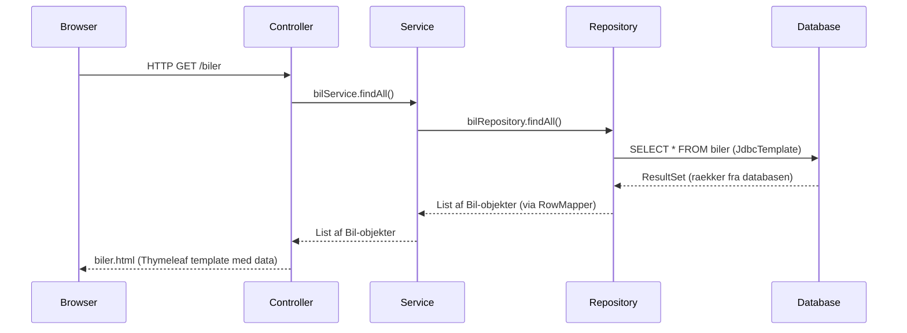

# Systemstruktur — bilAbonnement

Oversigt over hvordan systemet er bygget op, hvem der taler med hvem, og hvilke teknologier der bruges hvor.

---

## Spring Annotations og Lagdeling

Spring bruger annotations (@) til at fortaelle hvad hver klasse goer i systemet.
Hierarkiet er altid:

```
Controller  ->  Service  ->  Repository  ->  Database
```

| Annotation | Lag | Ansvar |
|---|---|---|
| `@Controller` | Praesentationslag | Haandterer HTTP-requests (GET/POST), modtager data fra browseren, sender data til viewet (Thymeleaf) |
| `@Service` | Forretningslogik | Indeholder logik, validering og regler. Traekker data sammen fra repositories |
| `@Repository` | Dataadgang | Henter og gemmer data i databasen via JdbcTemplate og SQL |

**Vigtig regel:** En controller maa ALDRIG tale direkte med et repository.
Controlleren kalder altid servicen, og servicen kalder repository.

---

## Diagram: Oversigt over hele systemet



---

## Diagram: Hvem taler med hvem?



---

## Diagram: Request-flow (hvad sker der naar brugeren klikker?)



---

## Teknologier brugt i hvert lag

### Controller-laget

| Teknologi | Hvad den goer |
|---|---|
| `@Controller` | Markerer klassen som en controller |
| `@GetMapping` | Haandterer HTTP GET-requests (hente data) |
| `@PostMapping` | Haandterer HTTP POST-requests (sende data) |
| `@RequestParam` | Henter vaerdier fra URL eller formular |
| `@ModelAttribute` | Binder formdata til et Java-objekt |
| `@PathVariable` | Henter vaerdier fra URL-stien |
| `Model` | Sender data fra controller til view (Thymeleaf) |
| `model.addAttribute()` | Tilfoejer data til modellen |
| `HttpSession` | Gemmer login-information paa tvaers af requests |
| `redirect:/` | Post/Redirect/Get pattern (undgaar dobbelt-submit) |

### Service-laget

| Teknologi | Hvad den goer |
|---|---|
| `@Service` | Markerer klassen som en service |
| `@Autowired` | Spring indsaetter dependencies automatisk (dependency injection) |
| Singleton pattern | RolleDefinitioner — een instans med alle roller og statusser |
| HashSet | Bruges i SkadeService til at fange duplikerede skadebeskrivelser |
| HashMap | Bruges i ForretningService til at taelle abonnementer per status |
| try/catch | Haandterer exceptions saa programmet ikke crasher |

### Repository-laget

| Teknologi | Hvad den goer |
|---|---|
| `@Repository` | Markerer klassen som et repository |
| `JdbcTemplate` | Spring-vaerktoj til at koere SQL paa en sikker maade |
| `jdbc.query()` | Koerer SELECT og returnerer en liste (0, 1 eller flere raekker) |
| `jdbc.queryForObject()` | Koerer SELECT og returnerer praecis 1 vaerdi |
| `jdbc.update()` | Koerer INSERT, UPDATE eller DELETE |
| RowMapper | Mapper hver raekke fra ResultSet til et Java-objekt |
| Parameteriseret query (?) | Beskytter mod SQL-injection |
| ArrayList | Bygger dynamiske SQL-parametre (hurtig index-adgang) |
| LinkedList + Iterator | Gennemlober skader ved indsaettelse (hurtig tilfoejelse) |

### Model-laget

| Teknologi | Hvad den goer |
|---|---|
| Plain POJO | Simpelt Java-objekt med felter, getters og setters |
| Tom konstruktoer | Kraeves af Spring til formular-binding og JDBC mapping |
| Singleton (RolleDefinitioner) | Privat konstruktoer + getInstance() = een instans |
| TreeSet | Bruges i BilController til unikke sorterede aargange |

### View-laget (templates)

| Teknologi | Hvad den goer |
|---|---|
| Thymeleaf | Template engine der genererer HTML med data fra controlleren |
| `th:each` | Looper gennem en liste (fx alle biler) |
| `th:text` | Viser en vaerdi i HTML |
| `th:field` | Binder et input-felt til et Java-objekt |
| `th:object` | Binder en hel formular til et Java-objekt |
| `th:action` | Angiver URL som formularen sender til |
| HTML | Strukturerer indholdet paa siden |
| CSS | Styler udseendet (farver, layout, skrifttyper) |

---

## Alle filer i projektet

### Controllers (7 filer)

| Fil | Taler med services | Endpoints |
|---|---|---|
| `PageController` | Ingen (statiske sider) | GET `/`, GET `/about` |
| `AuthController` | BrugerService | GET/POST `/login`, GET/POST `/signup`, GET `/logout` |
| `BilController` | BilService | GET/POST `/biler` |
| `KundeController` | KundeService | GET/POST `/kunder` |
| `AbonnementController` | AbonnementService, BilService | GET/POST `/abonnementer`, GET/POST `/abonnementer/opret` |
| `DataregistreringController` | AbonnementService, BilService, KundeService, BrugerService | GET/POST `/data/lejeaftale/opret` |
| `ForretningController` | ForretningService, BrugerService | GET `/dashboard`, POST `/dashboard/refresh` |
| `SkadeController` | SkadeService, KundeService, BrugerService | GET/POST `/skader/opret` |

### Services (6 filer)

| Fil | Taler med repositories | Forretningslogik |
|---|---|---|
| `BrugerService` | BrugerJdbcRepository | Login, signup |
| `BilService` | BilRepository | Hent og gem biler |
| `KundeService` | KundeJdbcRepository | Hent og opret kunder |
| `AbonnementService` | AbonnementJdbcRepository | Opret abonnement med validering |
| `ForretningService` | ForretningJdbcRepository | KPI-data og rapporter |
| `SkadeService` | SkadeJdbcRepository, AbonnementJdbcRepository | Skadevalidering (HashSet) og oprettelse |

### Repositories (6 filer)

| Fil | Tabel i databasen | Teknologi |
|---|---|---|
| `BrugerJdbcRepository` | brugere | JdbcTemplate, RowMapper |
| `BilRepository` | biler | JdbcTemplate, RowMapper |
| `KundeJdbcRepository` | kunder | JdbcTemplate, RowMapper |
| `AbonnementJdbcRepository` | abonnementer | JdbcTemplate, RowMapper, JOIN |
| `ForretningJdbcRepository` | abonnementer (KPI) | JdbcTemplate, HashMap, COUNT, SUM |
| `SkadeJdbcRepository` | skader | JdbcTemplate, LinkedList, Iterator |

### Models (8 filer)

| Fil | Hvad den repraesenterer |
|---|---|
| `Bil` | En bil i systemet |
| `Kunde` | En kunde |
| `Bruger` | En medarbejder (login + rolle) |
| `Abonnement` | Et abonnement |
| `AbonnementOversigt` | DTO til visning (JOIN resultat) |
| `AbonnementOption` | DTO til dropdown i skade-modul |
| `LejeaftaleForm` | Formular-binding til lejeaftale-oprettelse |
| `RolleDefinitioner` | Singleton med alle roller, statusser og kontrakttyper |

---

## Hvorfor denne struktur?

| Princip | Hvad det betyder | Eksempel |
|---|---|---|
| **Separation of concerns** | Hvert lag har eet ansvar | Controller = HTTP, Service = logik, Repository = database |
| **Dependency injection** | Spring opretter og indsaetter objekter automatisk | `@Autowired` paa service-felter i controlleren |
| **Singleton pattern** | Een instans af RolleDefinitioner i hele systemet | `RolleDefinitioner.getInstance()` |
| **MVC pattern** | Model-View-Controller adskiller data, visning og logik | Model = POJO, View = Thymeleaf, Controller = @Controller |
